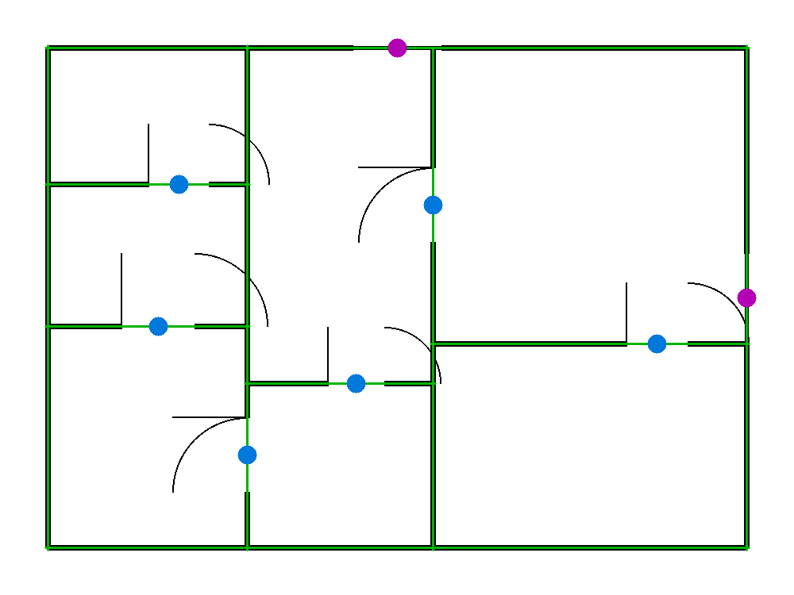

# Floorplan → 3D

Drop a clean 2D floor-plan image in the browser; it detects the **walls, doors
and windows**, lifts them into a **navigable 3D model**, and renders it with
three.js — orbit, zoom, and look through the doorways and windows.



```
image  ──►  detect.py  ──►  geometry.py  ──►  three.js viewer
            (walls,          (extruded 3D       (orbit / walk)
             doors,           boxes w/ real
             windows)         openings)
```

## The honest scope

This is **v1**, and it is deliberately narrow so every piece actually works:

- **Input:** a *clean* 2D floor-plan image (black walls on white, standard door
  swing-arcs and window double-lines). Hand-drawn photos and messy scans are
  **not** handled yet — that is the hard CV problem and a separate milestone.
- **Output:** a 3D model you can **view and walk through in the browser**
  (extruded geometry), **not** an editable AutoCAD/Revit DWG file. Those are a
  much deeper format-integration problem.
- **The "AI slice":** wall/door/window detection. In v1 it is **classical
  computer vision** (morphology + connected components), not a neural net —
  because on clean plans the structure is fully recoverable deterministically,
  which gives a correct, *measurable* baseline today. It lives behind one
  function, `detect.detect(path)`, so a learned segmentation model (trained on
  real photographed plans) can drop in later without touching the geometry,
  server, or viewer.

## Measured, not eyeballed

Detection is scored against synthetic plans with **exact ground truth**
(`synth.py` knows where it drew every wall/door/window). Over a 40-plan batch:

| metric          | score   | meaning                                            |
|-----------------|---------|----------------------------------------------------|
| wall coverage   | 97.8 %  | fraction of true wall length recovered             |
| door recall     | 98.9 %  | true doors found (midpoint within tolerance)       |
| window recall   | 100.0 % | true windows found                                 |

```sh
python synth.py 40 data/plan     # generate labelled plans
python measure.py data/plan      # averaged scores + per-plan overlay PNGs
```

`measure.py` also writes an `*.overlay.png` (detected walls in green, openings as
filled = found / hollow = missed) so failures are visible at a glance.

## Run it

```sh
pip install opencv-python-headless numpy pillow
python server.py                 # http://localhost:8000
```

Open the page, click **use the sample plan** (or drop your own clean plan PNG).

## Files

| file            | role                                                            |
|-----------------|-----------------------------------------------------------------|
| `synth.py`      | generate clean labelled floor plans (controlled test bed)       |
| `detect.py`     | **the AI slice** — walls/doors/windows from an image (v1: CV)   |
| `measure.py`    | score detection vs ground truth + visual overlay                |
| `geometry.py`   | 2D detection → 3D boxes with real door/window openings           |
| `static/index.html` | three.js navigable viewer                                   |
| `server.py`     | stdlib HTTP API tying image → detect → geometry → viewer         |

## Honest next steps

1. **Real-plan robustness** — the v1 detector assumes clean vector-like plans.
   Photographed/hand-drawn plans need a learned segmentation model; that is the
   genuine ML milestone and where "AI is the moat" would actually be earned.
2. **Rooms & furniture** — detect room polygons (data is already there in
   `synth.py`) and place fixtures; enables auto-furnishing / style suggestions.
3. **Scale calibration** — let the user set one real dimension so the 3D model
   is metric, not pixel-scaled.

Nothing here is claimed beyond what is measured: clean plans in, a correct
walk-through model out.
